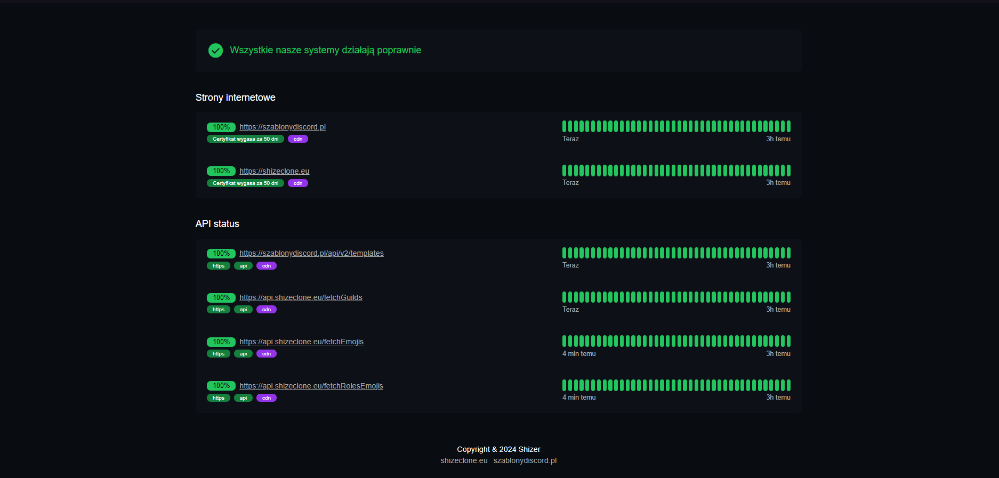

# 🌐 Status Monitor

Status Monitor to aplikacja do monitorowania dostępności stron internetowych i API w czasie rzeczywistym. Dane są aktualizowane co 5 minut, co pozwala na błyskawiczne reagowanie na potencjalne problemy z wydajnością lub dostępnością.

## 🛠️ Funkcjonalności

- **📊 Monitoring stron internetowych** – sprawdzanie statusu dostępności stron.
- **🛡️ Monitoring API** – śledzenie poprawności odpowiedzi API w różnych endpointach.
- **⏱️ Automatyczna aktualizacja** – dane są odświeżane co 5 minut.
- **📈 Intuicyjny interfejs** – czytelny widok statusu z wizualizacją historyczną. Pokazuje historię z ostatnich 3h oraz zestawienie % z ostatnich 24h.
- **🖥️ Monitorowanie zdarzeń** - Jeśli jakiś system przestanie działac zostaje odnotowany incydent i pokazuje go na stronie, pokazuje ostatnie 5dni.
- **❌ Automatyczne kasowanie danych** - Jeśli dane ze statusami są starsze niż 2 dni lub jest więcej niz 5 incydentów (1 dzien = 1 incydent) są automatycznie kasowane z bazy danych.

## 🔋 Statusy incydentów

| Status           | Opis                                                | Warunek czasowy           |
| ---------------- | --------------------------------------------------- | ------------------------- |
| **CHWILOWE**     | Endpoint nie działa przez krótki czas.              | Nie działa przez 5 minut  |
| **TYMCZASOWE**   | Endpoint nie działa przez dłuższy okres.            | Nie działa przez 10 minut |
| **POTWIERDZONE** | Długotrwały brak działania endpointu.               | Nie działa przez 15 minut |
| **ROZWIĄZANE**   | Endpoint ponownie działa po okresie niedostępności. | Zaczyna działać ponownie  |

---

## 🖼️ Podgląd



---

## 📦 Uruchomienie projektu

1. Sklonuj repozytorium:
   ```bash
   git clone https://github.com/TheProShizerr/status-website-api
   ```
2. Ręcznie trzeba skonfigurować cron joby, co ile maja scanować się szablony, usuwać dane itp.   

## 🌐 Link do strony

🔗 [Odwiedź stronę Status](https://status.shizeclone.eu)
